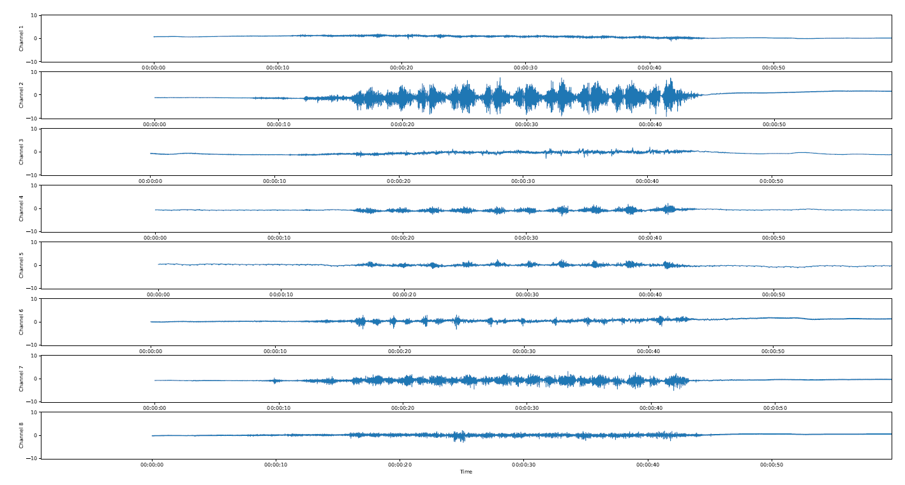

# EMG Evaluation Plot

This is a script for visualization of EMG data after a mesurement. It is to be used together with this multichannel EMG sensor: [Multichannel EMG Sensor](./../../../../emg-sensor_board)  

This script visualizes 8 channels simultaneously, and can easily be extended to more channels.

## Getting Started
To run a live visualization, perform the following steps:
1. Connect an SD card with readings on it to the PC
2. Start the visualization script

## Trouble Shooting
These are known issues and solutions:
1. The script did not find the data file: The SD drive must be under connected under 'D:\' the file name must be LOG.csv. If the file location changes or you want to visualize an other file change the FILE_LOCATION variable in the script. 
2. The Data Format is incorrect: If there is already a reading saved on the SD card and the user performs another reading, the already existing LOG.csv file is not overwritten, instead the writing process is contiued, seperating both measurments with a new header line. Separate the data by hand into two different files and visualize them separately.

## License
Copyright (c) 2024 Fraunhofer EMFT

Permission is hereby granted, free of charge, to any person obtaining a copy of this software and associated documentation files (the “Software”), to deal in the Software without restriction, including without limitation the rights to use, copy, modify, merge, publish, distribute, sublicense, and/or sell copies of the Software, and to permit persons to whom the Software is furnished to do so, subject to the following conditions:

The above copyright notice and this permission notice shall be included in all copies or substantial portions of the Software.

THE SOFTWARE IS PROVIDED “AS IS”, WITHOUT WARRANTY OF ANY KIND, EXPRESS OR IMPLIED, INCLUDING BUT NOT LIMITED TO THE WARRANTIES OF MERCHANTABILITY, FITNESS FOR A PARTICULAR PURPOSE AND NONINFRINGEMENT. IN NO EVENT SHALL THE AUTHORS OR COPYRIGHT HOLDERS BE LIABLE FOR ANY CLAIM, DAMAGES OR OTHER LIABILITY, WHETHER IN AN ACTION OF CONTRACT, TORT OR OTHERWISE, ARISING FROM, OUT OF OR IN CONNECTION WITH THE SOFTWARE OR THE USE OR OTHER DEALINGS IN THE SOFTWARE.

